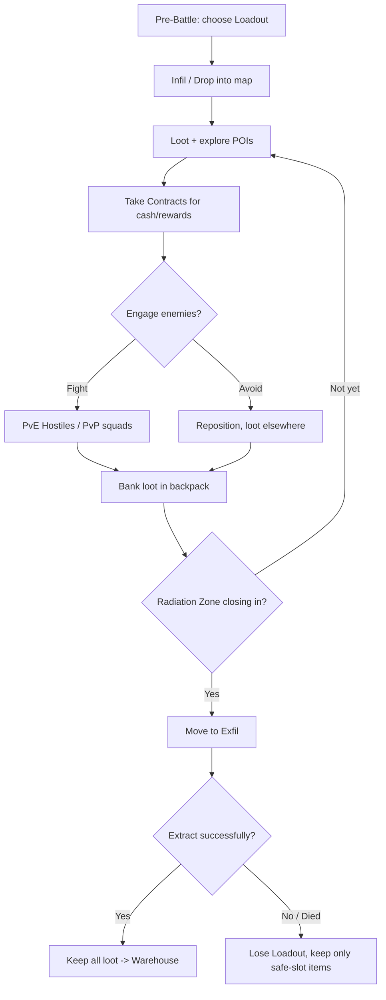
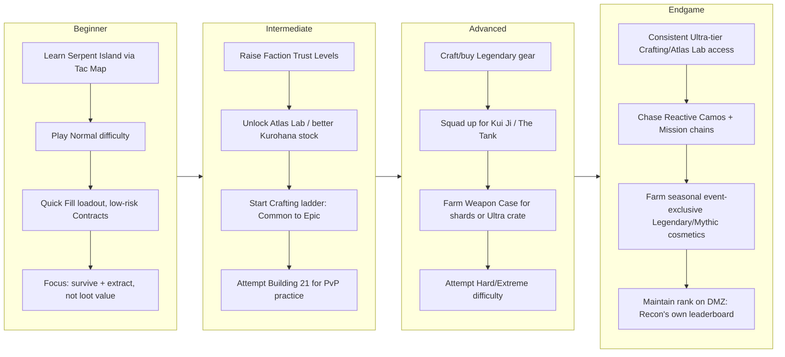

# Call of Duty: Mobile — DMZ: Recon: The Complete Survival & Loot Guide

*Compiled July 2026 from official Activision guides, the Call of Duty Fandom wiki, and cross-checked community sources (BlueStacks, Carry1st, GamingOnPhone, LDShop, Retbit, and others). Confirmed/official information is marked **[Official]**; community-discovered or unconfirmed mechanics are marked **[Community]**. Season-specific content is timestamped.*

> ⚠️ **A note on source quality before you read further.** DMZ: Recon is a *mobile-exclusive* mode that launched December 11, 2025. A large share of the "DMZ" content on the internet (GameSpot, Dot Esports, Game8, ONE Esports, Steam guides, etc.) is actually about **Call of Duty: Warzone 2.0 / Modern Warfare II's console-and-PC DMZ mode** — a completely different game with different maps (Al Mazrah, Ashika Island, Vondel), a different Juggernaut/Weapon Case system, and no relationship to CODM. This guide deliberately excludes that PC/console material and is built only from CODM: Mobile–specific sources. If you see advice elsewhere mentioning "Al Mazrah," "Juggernaut," or "Zarqwa Hydroelectric," it does not apply to CODM.
>
> Activision has **not** published exact numeric drop-rate percentages for loot rarities, boss drops, or Weapon Case contents. Where this guide can't cite a hard number, it says so rather than inventing one.

---

## Table of Contents

1. [DMZ: Recon Fundamentals](#1-dmz-recon-fundamentals)
2. [Survival Guide](#2-survival-guide)
3. [Loot Guide](#3-loot-guide)
4. [High-Value Loot](#4-high-value-loot)
5. [Weapon Case Guide](#5-weapon-case-guide)
6. [Kui Ji Boss Guide](#6-kui-ji-boss-guide)
7. [Kui Ji Operator Skins](#7-kui-ji-operator-skins)
8. [Legendary/Mythic Reward Catalog](#8-legendarymythic-reward-catalog)
9. [Meta Guide](#9-meta-guide)
10. [Farming Routes](#10-farming-routes)
11. [Progression Roadmap](#11-progression-roadmap)
12. [Advanced Tips](#12-advanced-tips)
13. [Sources](#13-sources)

---

## 1. DMZ: Recon Fundamentals

### 1.1 What the mode is **[Official]**

DMZ: Recon is CODM's third major game mode (alongside Multiplayer and Battle Royale), launched **December 11, 2025** as the headline feature of **Season 11: 6th Anniversary**. Squads of up to three drop into a map and fight a mix of **AI Hostiles and other real squads (PvPvE)**, loot gear, complete optional Contracts, and must reach an **Exfil** before the timer expires. If you extract, you keep everything you collected. If you die, you lose your Loadout — except whatever is in your **safe/insured slots**.

### 1.2 Match flow **[Official]**

### 1.3 Maps **[Official]**

| Map | Style | Added | Notes |
|---|---|---|---|
| **Serpent Island** | Large, Battle Royale-style, open | Launch (Dec 11, 2025) | Main map; mixes original POIs (Kurohana Ship/Base, Observatory, Serpent's Fortress) with layouts inspired by other CoD maps. Has an [interactive Tac Map](https://www.callofduty.com/guides/mobile/serpent-island) on callofduty.com |
| **Building 21** | Small, entirely indoor, 3 floors | Launch (Dec 11, 2025) | Garage → main floor (offices/restaurants) → lab/weapons storage. Fast, PvP-heavy, "endgame content" feel |
| **Rebirth Island** | Reworked from Alcatraz, visually upgraded | **Season 4: Eternal Prison (April 15, 2026)** | Manually-activated prison gates (30s countdown, then open 10s, island-wide alarm broadcast); a mid-match offshore nuclear explosion spreads radiation from the shoreline inward toward the center prison |

Two match variants exist:
- **Standard DMZ: Recon** — full-length runs (~25 minutes) across the whole map.
- **DMZ: Recon Quick Play** *(added Season 3: Paranoia, March 18, 2026)* — condensed to Serpent Island's northern POIs only (Kurohana Base, Observatory, Kurohana Ship, Port, Residential), up to 4 squads, exfil switch moved outside the Ship, faster and more PvP-dense.

### 1.4 Economy, gear loss, and insurance **[Official]**

- **Loadouts** need at minimum: a weapon, Armor + Armor Plates, Ammo, and a backpack. **Quick Fill** offers pre-made starter Loadouts (free or paid).
- Dying **strips your entire Loadout** except items in your **safe slot(s)** (upgradeable to hold more).
- **Cash** found/looted in a match funds Buy Stations (mid-run ammo/plate resupply) and **Payment Exfils** — it is separate from Warehouse currency earned from *successful* extractions.
- Successful extractions bank your loot; selling it funds future Black Market purchases.

### 1.5 The Black Market & Factions **[Official/Community]**

The Black Market is split into three faction shops, each raised via daily tasks that build **Trust Level**:

| Faction Shop | Function |
|---|---|
| **Kurohana Shop** | Cash purchases of weapons, bags, keys, throwables, armor. Higher-tier stock unlocks at higher Trust Level |
| **La Sous Terre Offers** | Daily discounted item batches (rarity/discount scale with Trust); unlocks **K9 Dispatch** — free periodic randomized item drops, with more K9s available at higher Trust |
| **Atlas Laboratory** | Spend cash (and the derived **Deepnet Cores** currency) on randomized advanced weapons/gear; a route to **Ultra rarity** items |

### 1.6 Talent Trees **[Official]**

Three trees, one active at a time (though you can level all three simultaneously with XP cards, earned via leveling and Missions):

| Talent | Focus | Active Skill | Best for |
|---|---|---|---|
| **Scavenger** | Intel gathering (see enemy footsteps/opened caches, hide your armor tier from enemies who hit you) | Fires a probe that scans a small area, revealing enemies on mini-map | Solo players, intel-focused squadmates |
| **Assaulter** | Aggression, faster/more precise operation | Rewind several seconds to a prior position — great for escaping ambushes | Aggressive players, PvE and PvP alike |
| **Medical** | Squad survivability | Smoke bomb for tactical retreat/cover/reviving | Squad play, supporting teammates |

### 1.7 Contracts **[Official]**

Your main non-loot income source. Found across the map; examples include eliminating HVTs, gathering intel, cracking a safe, or destroying Atlas Corp. materials. Contracts don't have to be finished before you exfil, but they take time and **attract other squads** — budget your remaining match time carefully.

### 1.8 Power progression: Rarity, Armor, Gunsmith, Crafting **[Official]**

- **Weapon/gear rarity tiers** exist (Common through Mythic, plus an **Ultra** tier above Mythic obtainable only via Atlas Laboratory or Crafting).
- **Armor** is rarity- and coverage-based rather than flat health: e.g., the Mythic (Level 5/Red) *Eaglewing MW Armor* covers the whole body but only 3 plate slots, while *Blackape MW Armor* covers arms/torso/head with 4 plate slots. Damage math is dynamic — higher-rarity weapons deal bonus damage to lower-rarity armor (example cited: a Legendary USS9 deals **1.2×** damage to Rare/Blue armor but only **0.85×** to Mythic/Red armor).
- **Gunsmith** removes the old 5-attachment cap — a weapon can equip as many attachments as it has slots, and slot count scales with rarity. On Legendary/Mythic weapons, attachment *compatibility is randomized per individual drop* (one Legendary XM4 might have 8 slots, another only 5); Ultra rarity weapons always have full slots.
- **Crafting** *(added DMZ: Recon Season 1)* lets you combine miscellaneous "ingot-marked" loot materials + a rarity-matched Universal Weapon Material to build gear cheaper than buying it outright. Higher recipes unlock by crafting a set number of the preceding rarity (e.g., 2 Epic items unlocks Legendary recipes); some recipes (like the Mythic USS 9) must instead be *found* in-map.
- **Difficulty levels** (Normal / Hard / Extreme per community sources) gate which gear tiers you can bring in and scale AI/enemy toughness — Normal is recommended for new players to learn map/exfil/enemy patterns without harsh gear-loss risk. **[Community — exact mechanical differences between difficulty tiers aren't detailed in official documentation found at time of writing]**

---

## 2. Survival Guide

### 2.1 Early game

- Land on the **edge of the map**, not the hottest POI, if you're not fully kitted — grab plates, a workable gun, maybe a vehicle before your first real fight.
- Pick a **low-drama Contract** first (PvE-focused) to build cash without dragging you into PvP.
- Default to **Normal difficulty and Serpent Island** while you're learning exfil locations and enemy patterns; save Building 21 and Hard/Extreme difficulty for once you're consistent.

### 2.2 Mid-game

- Once armed, decide per-encounter: **spot-and-avoid** vs. **engage**. You are never required to fight — sometimes just clocking an enemy and repositioning keeps you alive.
- Hostile-type matchups **[Official]**:

| Hostile type | Recommended approach |
|---|---|
| Normal Infantry | Standard engagement |
| Snipers | Close the distance — get up close and personal |
| Flametroopers | Keep your distance, don't close in |
| Rocketeers | Use cover, break line of sight |

- Use **elevation** (rooftops, cliffs on Serpent Island) for overwatch.
- Your **melee weapon (knife) increases movement speed** relative to carrying a gun — switch to it when you need to book it toward an Exfil. **[Community]**

### 2.3 Late-game / exfil phase

- **Start watching Exfil options before the timer forces your hand.** The Radiation Zone will delete Exfil points once gas reaches them — even with a Gas Mask.
- Exfil types **[Official]**:

| Exfil type | Requirement |
|---|---|
| **Normal** | Reach the marked zone (green smoke), stand near it until timer completes |
| **Random** | Same as Normal but spawns unpredictably — can bail you out of a bad spot |
| **Payment** | Requires cash *on hand* (not Warehouse balance) |
| **Boat** | Multi-step: activate terminal, then reach the boat before timer ends; clear the area first |
| **Train** | Multi-step: interact with station terminal, go upstairs, board the train when it arrives |
| **Elevator** (Building 21 only) | Hit the call button, then defend the location for a short countdown |

- None of these are safe zones until extraction completes — you can be eliminated mid-timer.

### 2.4 Solo vs. Duo vs. Full Squad

| Squad size | Strategy notes |
|---|---|
| **Solo** | Favor the Scavenger Talent for intel; avoid boss fights and safe-cracking (they draw crowds you can't out-gun alone); prioritize stealth routes and Random Exfils |
| **Duo** | Split roles — one Scavenger/intel, one Assaulter/damage; still avoid over-committing to loud objectives |
| **Full squad (3)** | Can realistically contest bosses (Kui Ji, The Tank) and Safes; run a Medical Talent user to keep the squad topped up and enable revives under fire |

### 2.5 Risk management & common mistakes **[Community]**

- **Don't overcommit to loot.** Extracting with moderate gains beats dying with a full bag.
- **Gunfire pulls attention** — both AI and nearby squads. If you're under-geared or carrying mission items, staying quiet is a valid strategy, not cowardice.
- **Boss hunts (Kui Ji, The Tank) are PvP magnets.** Expect other squads to converge on the noise.
- Beginner mistakes repeatedly flagged by guides: rushing the loudest POI immediately on drop, finishing a long Contract without checking the clock, fighting for legendary/mythic loot in contested safe rooms instead of "filling the bag" in safer zones first, and waiting until the last minute to look for an Exfil (running into desperate, nothing-to-lose squads).

---

## 3. Loot Guide

### 3.1 Rarity tiers **[Official]**

CODM DMZ: Recon uses a standard low→high rarity ladder, confirmed via the Armor examples and Weapon Case reward structure:

**Common → Rare (Blue) → Epic (Purple, implied) → Legendary (Gold, implied) → Mythic (Level 5 / Red) → Ultra (highest, Atlas Lab/Crafting exclusive)**

Exact numeric drop chances per rarity **are not published by Activision** and no reliable third-party datamine of drop tables was found for CODM's DMZ: Recon specifically at time of writing — treat any specific percentage you see elsewhere with skepticism.

### 3.2 What's confirmed about acquisition, by rarity

| Rarity | Confirmed acquisition paths |
|---|---|
| Common / Rare | General map loot, Kurohana Shop cash purchases at low Trust Level |
| Epic | Better map loot pools, Kurohana Shop at higher Trust, Crafting (after enough Rare crafts) |
| Legendary | Crafting (after crafting 2 Epic items unlocks Legendary recipes), Atlas Laboratory, Weapon Case Shard Crate blueprints, Battle Pass/Draw rewards |
| Mythic | High-tier map loot (e.g., Mythic Armor pieces, Mythic USS9 via a found recipe), Atlas Laboratory, seasonal Draws |
| Ultra | **Only** via Atlas Laboratory or Crafting — the rarest confirmed acquisition path in the mode |

Community guides generally agree that **higher-value loot clusters around Safes/Vaults, Boss fights (Kui Ji, The Tank), and contested named POIs**, at the cost of drawing more PvP attention — but no source breaks down drop odds by specific POI or map (Serpent Island vs. Building 21 vs. Rebirth Island) with hard numbers.

### 3.3 Safes and Vaults **[Official]**

- Larger Safes **sound an alarm audible to nearby players** the moment you start cracking them.
- Expect **heavy AI Hostiles guarding the approach** — clear them before you start the crack.
- Cracking uses a **lock-picking minigame** (follow on-screen tumbler prompts) — speed matters, because the alarm invites contest.

---

## 4. High-Value Loot

Based on confirmed mechanics, the mode's genuinely high-value loot categories are:

| Category | How it's obtained (confirmed) |
|---|---|
| **Mythic/Ultra weapons** | Atlas Laboratory, Crafting (rarity-gated recipes, some map-found), seasonal Mythic Draws (real-money/CP gacha, not free) |
| **Legendary weapons** | Crafting, Atlas Lab, Battle Pass tiers, Weapon Case Shard Crate blueprints |
| **Legendary/Mythic Armor** | Map loot (higher-tier POIs, Safes), Atlas Lab |
| **Backpacks** | Persist across successful extractions if kept — bigger backpacks improve carry capacity for future runs |
| **Weapon Case** | Boss kill reward (see Section 5) — a *choice* between a Gold Loot Crate (chance at Ultra rarity) or a Shard Crate (progress toward Kui Ji cosmetics) |
| **Keys** | Referenced by community sources as unlocking specific safes/rooms; exact key→location pairings are not comprehensively documented in official sources found |
| **Reactive Camos** | Earned through completing Missions (Faction, Weekly, Achievement) — usable across *all* CODM modes, not just DMZ |
| **Crafting materials** | "Ingot-marked" loot items + Universal Weapon Materials (rarity-specific, e.g., T-3 Ore, Gold Bars for Mythic tier) |
| **Event-exclusive items** | Seasonal collab rewards (Street Fighter, NieR: Automata, Pop Team Epic, Godzilla x Kong, The Boys, Persona 5 Royal) — these rotate with each season and are largely **time-limited** |

---

## 5. Weapon Case Guide

**[Official / Fandom Wiki, cross-checked against callofduty.com]**

### 5.1 How it works

- The Weapon Case is one collectible object per match, contested by every squad that spots it.
- **Acquisition differs by map:**
  - **Serpent Island:** Defeat the boss **Kui Ji** — he drops the Weapon Case on death. You must then **extract with it** for the reward to count.
  - **Building 21:** Complete a specific task to break into the **Central Lab** (rather than the Armory as in console DMZ) to obtain it.
- Simply holding the case isn't enough — **you must successfully exfil** with it.

### 5.2 Rewards

On extraction, the Weapon Case gives you a choice between:

| Option | What it gives |
|---|---|
| **Gold Loot Crate** | A chance at an **Ultra rarity** loot item (the mode's highest tier) |
| **Shard Crate** | Item shards toward Kui Ji cosmetics, or weapon blueprints |

Shard Crate contents (confirmed shard costs per the Fandom wiki):

| Item | Shards required |
|---|---|
| **Jetplate Slayer** uniform (Kui Ji operator skin) | 120 shards |
| **Lily Maru** — Kui Ji's katana melee blueprint | 80 shards |
| **Shuriken** — a Combat Axe skin | 80 shards |

Additional weapon blueprints are also in the Shard Crate pool; once a specific blueprint is acquired, it's removed from the pool, increasing your odds for the remaining ones (this pity-style mechanic does **not** apply to the shard-based cosmetics above — those are cumulative progress, not RNG pulls).

### 5.3 Best strategy for farming Weapon Cases

1. Build a loadout capable of taking down Kui Ji safely (see Section 6) *before* you commit to hunting the case.
2. Expect PvP contest — other squads will converge once Kui Ji is engaged or the case is picked up.
3. Prioritize **extraction over additional looting** once you have the case; every extra minute risks losing it (and your run) to a third-party squad.
4. On Building 21, scout the Central Lab task requirements ahead of time since that map's compressed layout leaves little room to disengage from a bad fight.

---

## 6. Kui Ji Boss Guide

**[Official]**

### 6.1 Identity & location

Kui Ji (full name **Ryotaro "Kui Ji" Nagashima**, confirmed via the Season 5 Mythic Draw description) is a named boss found around the **Kurohana Ship** on Serpent Island. He and the other boss, **The Tank**, spawn in fixed general areas but move around nearby — once found, the mini-map gives a clear proximity warning, so you'll generally know where to look for them again.

### 6.2 Mechanics

- Kui Ji is **extremely dangerous at close range** — he can perform a **Finishing Move** that removes you from the game instantly if he closes the gap.
- **Fight him at a distance.** Do not let him close in.
- On defeat, he drops a **rare reward** (the Weapon Case, per Section 5) — but you must then survive the trip back to an Exfil.

### 6.3 The Tank (for comparison)

- A heavily armored, heavily armed **robot on wheels**.
- Bring **plenty of ammo** to break its armor.
- Best engaged **from range or from cover** — once it locks onto you, it unloads a heavy payload of rounds on your position.

### 6.4 Strategy summary

| Approach | Notes |
|---|---|
| **Solo** | High risk — the Finishing Move one-shots you if he closes distance; only attempt with a long-range weapon and an escape plan already mapped |
| **Squad** | Split roles: one/two players suppress at range while a Medical-Talent player stays ready to revive; expect rival squads to show up mid-fight since boss encounters are loud |
| **Weapon choice** | Prioritize range and stopping power over close-quarters weapons — official guidance is explicit that keeping distance is the core defensive tactic |
| **Post-kill plan** | Have your Exfil route picked *before* you engage — the fight and the case both attract other squads |

---

## 7. Kui Ji Operator Skins

There are **two distinct Kui Ji cosmetics** — don't confuse them:

| Skin | Type | How to get it | Permanent? | Cost |
|---|---|---|---|---|
| **Jetplate Slayer** | Free, grindable in-mode uniform | Weapon Case → Shard Crate, accumulate 120 shards | Yes, once unlocked | Free (time/grind cost only) |
| **Viridescent Oath** (Mythic Kui Ji) | Premium Mythic Operator Draw | **Season 5: Revenge** (launched May 27, 2026) gacha-style Lucky Draw, alongside a Legendary 3-Line Rifle — Verdant Vow blueprint | Yes, once pulled | CP/real-money Draw — RNG-based paid pull |

### 7.1 Jetplate Slayer — the free grind

- **Fragments/shards required:** 120 (confirmed).
- **Drop source:** Weapon Case → Shard Crate choice, earned by defeating Kui Ji (Serpent Island) or completing the Central Lab task (Building 21) and **extracting successfully**.
- **Best farming method:** Repeated successful Weapon Case extractions, consistently choosing the Shard Crate over the Gold Loot Crate until you hit 120 shards. Since the Weapon Case is a once-per-match, heavily-contested item, this is a **slow grind** measured in many matches, not a single-session unlock.
- **Reward pool:** Shards compete for allocation against the Lily Maru katana blueprint (80 shards) and Shuriken combat axe skin (80 shards) from the same Shard Crate pool — community sources don't confirm whether shard allocation is random-per-crate or player-chosen, so budget for some inefficiency.
- **Seasonal risk:** Because Weapon Case rewards are pulled from a rotating pool, expect the exact contents (or the presence of new competing cosmetics) to shift each season — check patch notes before grinding hard for older-season cosmetics.

### 7.2 Viridescent Oath — the premium route

- Purely a **paid Lucky Draw** (introduced Season 5, not part of the free Weapon Case loop).
- No fragment/shard system — standard gacha-style single or multi-pull mechanics apply, meaning it's **RNG-gated by CP spend**, not skill or grind.
- If your goal is *any* Kui Ji cosmetic and you don't want to spend, the Jetplate Slayer route via Weapon Case grinding is your only free path.

---

## 8. Legendary/Mythic Reward Catalog

Building a truly exhaustive, still-accurate catalog of *every* Legendary/Mythic item across a live-service mode that has already run six-plus seasons of rotating Battle Passes, Draws, and events is not realistic to hand-verify item-by-item — Activision doesn't publish a master list, and most of these rewards are seasonal and rotate out. Below is a confirmed catalog of what's been *specifically documented* for DMZ: Recon, organized honestly by how permanent/farmable each category is.

| Reward | Source | Acquisition method | RNG involved? | Permanent? | Seasonal / resets? |
|---|---|---|---|---|---|
| Jetplate Slayer (Kui Ji skin) | Weapon Case Shard Crate | Grind: defeat Kui Ji/Central Lab task + extract, repeat to 120 shards | Low (progress-based, not pure RNG) | Yes | Reward pool composition can rotate each season |
| Lily Maru (Kui Ji katana blueprint) | Weapon Case Shard Crate | Same loop, 80 shards | Low | Yes | Same pool as above |
| Shuriken (Combat Axe skin) | Weapon Case Shard Crate | Same loop, 80 shards | Low | Yes | Same pool as above |
| Viridescent Oath (Mythic Kui Ji operator) | Season 5 Mythic Draw | Paid CP gacha pull | High (gacha RNG) | Yes, once pulled | Season 5-specific Draw; may not return |
| Legendary 3-Line Rifle — Verdant Vow | Season 5 Mythic Kui Ji Draw | Bundled with the Draw above | High | Yes | Season 5-specific |
| Ultra rarity item (unspecified) | Weapon Case Gold Loot Crate | Defeat Kui Ji/Central Lab task + extract, choose Gold Crate | High (chance-based) | Yes | Pool likely rotates seasonally — not documented |
| Ultra rarity gear (general) | Atlas Laboratory / Crafting | Spend cash + Deepnet Cores, or craft with rare materials + recipe | Craft: low RNG / Atlas Lab: moderate RNG | Yes | Ongoing system, not seasonal |
| Reactive Camos (20+ added at launch) | Mission completion (Faction/Weekly/Achievement) | Complete the associated Mission chain | None (skill/time-gated) | Yes, cross-mode usable | Ongoing, Missions refresh each season |
| DMZ: Recon Legendary Secret Cache, Epic avatar/frame/calling card | Pre-launch "Intel Debrief" event (Nov 26–Dec 11, 2025) | Completed event tasks | None | Yes, once earned | **Expired** — this was a limited pre-launch event, no longer obtainable |
| Season-collab Legendary/Mythic weapon blueprints (Street Fighter ICR-1, NieR: Automata Kestrel/Fiona items, Godzilla x Kong DP27, The Boys DRH/Sten/DLQ33, Persona 5 Royal LK24/QQ9/Type 63/RAM-7, etc.) | Seasonal Battle Passes / Draws / Armories | Battle Pass progression (some free-tier) or paid Draws | Varies — Battle Pass tiers are skill/time-gated, Draws are RNG/paid | Yes, once earned | **Season-specific** — tied to the season they launched in; some return later via "Vault" re-releases (confirmed happening with Season 5's Heat/Digital Dusk Vault Battle Passes) |

**Honest gap disclosure:** No official or community source found provides a complete, verified list of *every* Legendary/Mythic backpack, vehicle skin, charm, or calling card specific to DMZ: Recon as a standalone catalog — these are typically folded into each season's general Battle Pass/event coverage rather than tracked as a "DMZ rewards list." If you want the full current list, the most reliable move is to check the **in-game Gallery/Weapon Catalog** (referenced in the Fandom wiki as the mode's own collectible tracker) and the current season's official blog post on callofduty.com/blog/mobile.

---

## 9. Meta Guide

### 9.1 Important caveat

CODM does not currently have a well-documented, dedicated **"DMZ: Recon weapon tier list"** separate from its general Multiplayer/Battle Royale meta — the community coverage found (GamsGo, CODMunity, TikTok creators) discusses either (a) general CODM Season 5/6 weapon tier lists, or (b) **console/PC Warzone DMZ** loadouts, which don't transfer (different weapon roster entirely — CODM confirmed it **excludes new MW3-era weapons** from its own DMZ mode per community sources). Treat any "best DMZ Recon gun" list you find online with real skepticism unless it explicitly names CODM and cites a recent season.

### 9.2 What is confirmed and transferable

- **General weapon-class principles still apply in DMZ: Recon** because it uses the same CODM Gunsmith and weapon roster as Multiplayer/BR, just with rarity-based attachment slots layered on top.
- Recent (Season 5, "Revenge," May 2026) general balance changes reported by community trackers: **Switchblade X9** buffed (stomach multiplier 0.9×→1.0×, +3% move speed via OWC Skeleton Stock) and moved toward the top of general tier lists; **SO-14** received mobility nerfs and dropped in general tier lists; **CX9** and **Fennec** received range/ADS/recoil nerfs.
- The **BAL-27** (a bullpup AR with an accelerating fire rate on sustained fire) was added via the Season 5 Battle Pass free track and was reported as an immediate top-10 general pick.
- For **DMZ boss fights specifically** (Kui Ji, The Tank), official guidance emphasizes **range and sustained damage** over close-quarters weapons — favor Assault Rifles, Marksman Rifles, or LMGs with strong mid-to-long-range control rather than SMGs/shotguns when boss-hunting.
- **Higher attachment-slot count matters more in DMZ: Recon than in standard modes** because of the rarity-gated Gunsmith system — an instance of a weapon with more available slots is objectively more valuable than a lower-slot instance of the *same* weapon and rarity, so don't assume "same gun, same rarity" means "same power."

### 9.3 Perks, talents, equipment for DMZ specifically

| Category | Recommendation | Why (DMZ-specific reasoning) |
|---|---|---|
| Talent | **Scavenger** for solo/loot-focused play | Passive intel (enemy footsteps, opened-cache detection) has no equivalent outside DMZ and directly reduces surprise-death risk |
| Talent | **Medical** for squad play | Only Talent with direct squad-wide survivability tools (smoke cover + revive support) |
| Talent | **Assaulter** for boss/PvP-focused play | Rewind Active Skill is a unique escape tool not available in Multiplayer/BR, useful for surviving Kui Ji's Finishing Move range |
| Equipment | Gas Mask | Directly counters the Radiation Zone mechanic that deletes Exfils |
| Tactical | Melee/Knife swap | Confirmed movement speed boost over holding a weapon — use for the final Exfil sprint |

---

## 10. Farming Routes

Because Activision has not published fixed loot-table locations or POI-by-POI drop-rate data for DMZ: Recon (unlike, say, console DMZ's documented Weapon Case POIs), the routes below are **synthesized best-practice patterns from official mechanics and community consensus**, not verified turn-by-turn paths.

### 10.1 Safe money farming (low PvP risk)

1. Drop on the **edge** of Serpent Island, away from the Kurohana Ship/Central POIs.
2. Take **one PvE-only Contract** near your landing zone.
3. Loot buildings along your route to the Contract objective.
4. Cash out via a **Normal or Random Exfil** near the map edge rather than pushing toward center-map action.

### 10.2 Solo loot farming

1. Prioritize **Scavenger Talent** for early-warning intel.
2. Avoid Safes/Vaults and boss areas — these guarantee PvP contact.
3. Loot mid-tier buildings, complete 1–2 low-drama Contracts, and exfil once your bag is "worth it" rather than "full."

### 10.3 Legendary/Mythic farming

1. Requires **Atlas Laboratory access** (cash + Deepnet Cores) or **Crafting** — both need sustained Trust Level and repeated successful extractions to fund.
2. Build Trust Level first via consistent daily faction tasks before expecting Legendary-tier stock.
3. Bank materials for Crafting recipes — remember Legendary recipes require having crafted 2 Epic items first, so plan a "crafting ladder" run rather than expecting to skip straight to Legendary gear.

### 10.4 Boss/Mythic-adjacent farming (Weapon Case route)

1. Full squad strongly recommended — see Section 6.4.
2. Gear a long-range loadout before committing.
3. Engage Kui Ji at range, extract with the case immediately, choose Shard Crate consistently if grinding toward Jetplate Slayer.

### 10.5 Fast extraction / minimal PvP

- Favor **Random Exfils** — their unpredictable spawn location reduces the odds of camping squads knowing exactly where you'll surface.
- Keep your **melee weapon equipped for the final sprint** to the Exfil zone.
- Plan your Exfil **before** you take your last Contract or loot stop, not after.

---

## 11. Progression Roadmap

| Stage | Priorities |
|---|---|
| **Beginner** | Learn map layout (use the official interactive Tac Map), play Normal difficulty, take Quick Fill loadouts, focus purely on *surviving to extraction* — don't chase loot value yet |
| **Intermediate** | Build Faction Trust Level daily, start a Crafting ladder (Common→Epic unlocks Legendary recipes), begin mixing in Building 21 for PvP reps |
| **Advanced** | Squad up specifically for boss content (Kui Ji, The Tank), begin Weapon Case farming, push into Hard/Extreme difficulty once your gear can support it |
| **Endgame** | Sustain Ultra-tier access via Atlas Lab/Crafting, chase Reactive Camo Mission chains (cross-mode value), farm current-season event-exclusive cosmetics before they rotate out |

---

## 12. Advanced Tips

**[Community — flagged where not officially confirmed]**

- **Secure/safe slot discipline:** Treat your safe slot as insurance for one irreplaceable item (a Contract-required item or a valuable small item), not a dumping ground.
- **Don't chase every "broken" strategy clip.** Community guides explicitly warn that much of what circulates as "broken DMZ meta" is farmed-for-clips content that doesn't hold up under real match pressure — DMZ punishes overconfidence quickly.
- **Trust Level compounds** — even simple daily tasks ("extract rare items," "complete a couple Contracts") stack meaningfully faster than they first appear to.
- **Treat Black Market purchases mid-run as a boost, not a shopping spree** — if you're already winning fights, upgrade; if you're barely surviving, save the cash and focus on getting your current loot out.
- **Stay current each season rather than memorizing "the meta."** AI tuning, Contract types, exfil locations, and the Weapon Case reward pool have all changed across Seasons 1–6 — a strategy that worked at launch (December 2025) may be outdated by the time you read this (July 2026).
- **Misconception to avoid:** assuming identical weapon name + rarity = identical power. Attachment-slot randomization on Legendary/Mythic weapon instances (Section 1.8) means two "Legendary XM4s" can differ meaningfully — inspect before committing to a loadout plan.
- **Inventory management:** Given backpacks persist across extractions and larger ones must be earned/kept, prioritize backpack upgrades early since carry capacity gates how much of any given farming run is actually profitable.

---

## 13. Sources

- [DMZ: Recon 101 How to Play — Official Call of Duty Guide](https://www.callofduty.com/guides/mobile/dmz-recon-101-how-to-play) (Dec 8, 2025)
- [Call of Duty: Mobile Season 11 — 6th Anniversary (DMZ: Recon launch)](https://www.callofduty.com/blog/2025/11/call-of-duty-mobile-season-11-6th-anniversary-dmz-recon-street-fighter-battle-pass)
- [Call of Duty: Mobile Season 3 — Paranoia (DMZ: Recon Quick Play)](https://www.callofduty.com/blog/2026/03/call-of-duty-mobile-season-3-2026-paranoia)
- [Call of Duty: Mobile Season 4 — Eternal Prison (Rebirth Island added to DMZ)](https://www.callofduty.com/blog/2026/04/call-of-duty-mobile-season-4-2026-eternal-prison)
- [Call of Duty: Mobile Season 5 — Revenge (Mythic Kui Ji Draw)](https://www.callofduty.com/blog/2026/05/call-of-duty-mobile-season-5-2026-revenge-the-boys)
- [Call of Duty: Mobile Season 6 — Take Your Heart](https://www.callofduty.com/blog/2026/06/call-of-duty-mobile-season-6-take-your-heart)
- [DMZ: Recon — Call of Duty Fandom Wiki](https://callofduty.fandom.com/wiki/DMZ:_Recon) (armor system, crafting, factions, Weapon Case shard costs, Quick Play details)
- [Weapon Case — Call of Duty Fandom Wiki](https://callofduty.fandom.com/wiki/Weapon_Case)
- [BlueStacks — DMZ Recon Mode Guide for Call of Duty Mobile](https://www.bluestacks.com/blog/game-guides/call-of-duty-mobile/cod-recon-mode-guide-en.html)
- [Carry1st — How to Play Call of Duty Mobile's DMZ: Recon Mode](https://www.carry1st.com/blog/how-to-play-call-of-duty-mobiles-dmz-recon-mode)
- [GamingOnPhone — Call of Duty Mobile: DMZ Recon Guide](https://gamingonphone.com/guides/call-of-duty-mobile-dmz-recon-guide-overview-tips/)
- [Retbit — 10 Tips for the Call of Duty Mobile DMZ: Recon Mode](https://www.retbit.com/2026/01/15/10-tips-for-the-call-of-duty-mobile-dmz-recon-mode/)
- [GamsGo — Best COD Mobile Guns: Season 5 Meta & Loadouts](https://www.gamsgo.com/blog/best-guns-in-cod-mobile) (general CODM meta, not DMZ-specific — used only for confirmed balance-patch facts)

